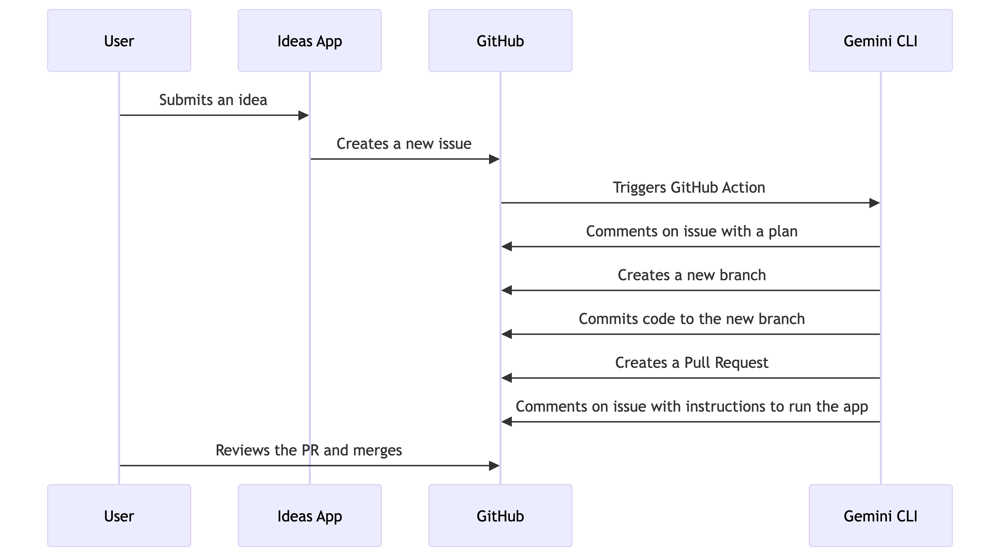

# Idea to Code: AI Asia 2025 Demo

Welcome! This repository contains the source code for the "Idea to Code" demo application, showcased at the Google Cloud booth during [AI Asia 2025: Building Beyond Borders](https://cloudonair.withgoogle.com/events/sg-ai-asia-building-beyond-borders?utm_campaign=FY25-Q3-APAC-APA35466-physicalevent-er-AI-Asia-75958&utm_source=linkedIn&utm_medium=social_leadgenform&utm_content=frontier-reg&utm_term=-) in Singapore.

This interactive demo showcases how generative AI can dramatically accelerate the software development lifecycle, taking a simple idea from concept to a functional, deployable prototype in minutes.

## 💡 Idea Gallery

All the ideas generated during the event are available for you to explore in our interactive gallery.

**[Browse the Idea Gallery](https://pauldatta.github.io/booth-ideas-sg/)**

## Demo Video

Watch the complete demonstration of the "Idea to Code" workflow in action.

## Workflow

The following diagram illustrates the end-to-end process from idea submission to generating a full-fledged application.

## Accessing Your Generated Code

For visitors at the AI Asia 2025: Building Beyond Borders booth:

1.  When you submit your idea through our application, a new **GitHub Issue** is automatically created in this repository.
2.  Our [Gemini CLI](https://github.com/google-github-actions/run-gemini-cli) will process your idea, generate the code, and push it to a **new branch**.
3.  The [Gemini CLI](https://github.com/google-github-actions/run-gemini-cli) will then post a **comment in your GitHub Issue** containing the name of the branch and step-by-step instructions on how to clone the repository and access your code.
4.  Simply find your issue in the [Issues tab](https://github.com/pauldatta/booth-ideas-sg/issues) and follow the instructions in the comments.

## Application

The web application itself is a Next.js project located in the `ideas-app/` directory. See the [application's README](ideas-app/README.md) for instructions on how to run it locally.
